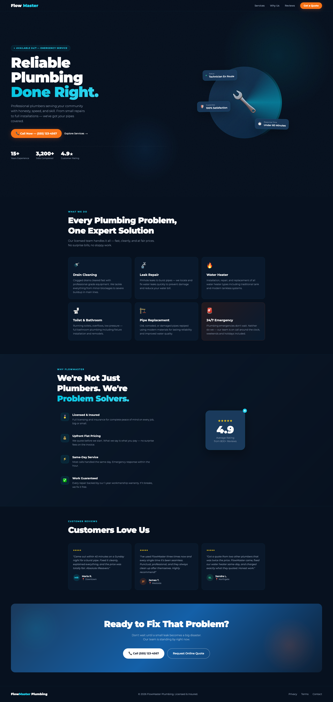

# 🔧 FlowMaster Plumbing — Modern Landing Page

## 📖 Overview

A modern, conversion-focused landing page built for a professional plumbing business. Designed to build immediate trust with visitors while driving phone calls and quote requests — the two highest-value actions for a local service business.

The design combines a dark navy aesthetic with cyan and orange accents, animated UI elements, and a clean Montserrat typography system. Every section is purpose-built: from the animated hero that communicates urgency and availability, to the review section that builds social proof, to the CTA that pushes the visitor to act.

## ✨ Key Features

* **Animated Hero Section:** Floating status cards, a rotating glow ring, and staggered fade-up animations create a strong, memorable first impression.
* **24/7 Emergency Emphasis:** Prominent badge, service card, and CTA copy all reinforce around-the-clock availability — critical for plumbing businesses.
* **Scroll Reveal Animations:** Sections animate in as the user scrolls, keeping engagement high throughout the page.
* **Services Grid:** Six service cards with hover effects and animated arrow indicators, including a highlighted emergency card.
* **Trust Signals:** Licensing badge, flat-pricing guarantee, same-day service, and 1-year workmanship warranty — all presented visually in the "Why Us" section.
* **Star Rating Block:** A large 4.9★ rating callout with ghost typography backdrop adds visual depth and authority.
* **Customer Reviews:** Three testimonial cards with avatar initials, color-coded per reviewer.
* **Fully Responsive:** Adapts cleanly across desktop, tablet, and mobile breakpoints.

## 🛠️ Scalability & Customization

This project is built as a clean, single-file foundation that's easy to extend:

* **Contact Form Integration:** Add a real form with backend (e.g. Formspree, EmailJS, or custom PHP) to replace the quote button.
* **Google Maps Embed:** Drop in a service area map to boost local SEO and trust.
* **Multi-location Support:** Duplicate sections or add a location switcher for businesses serving multiple cities.
* **CMS Integration:** Port into a WordPress theme, Webflow template, or Next.js project with minimal restructuring.
* **Analytics Ready:** Add Google Analytics or Meta Pixel tracking to the `<head>` without any structural changes.

## ⚙️ Tech Stack

* **Markup:** HTML5
* **Styling:** Tailwind CSS v3 (CDN)
* **Typography:** Montserrat via Google Fonts
* **Animations:** Pure CSS keyframes + Intersection Observer API
* **Icons:** Emoji-based (no icon library dependency)
* **No build step required** — open in any browser, deploy anywhere

## 📸 Project Showcase
*A bold, trust-building first impression with live status indicators and emergency availability messaging.*

---

*Looking for a custom landing page for your local business? Let's connect!*
